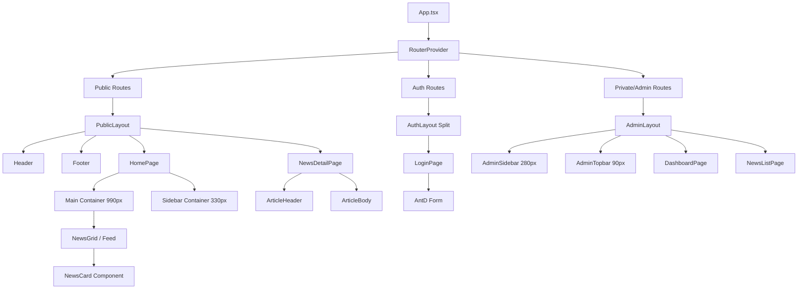

# Frontend Architecture: Diario Digital

Basado en el diseño de Paper y los requerimientos del documento de UX/UI, aquí se detalla la arquitectura frontend.

## 1. Ruteo y Navegación (React Router)

La aplicación utilizará `react-router-dom`, organizando las rutas mediante tres Layouts principales que reflejan los distintos Artboards del diseño.

### Rutas Públicas (Layout: `PublicLayout`)
Se mapea a los Artboards `6W-0` (Home) y `R0-0` (Detalle).
- **Estructura:** Header global ("DIARIO DIGITAL") + Contenido + Footer global.
- **Rutas:**
  - `/` - **Home:** Renderiza el feed de noticias.
  - `/news/:slug` - **Detalle:** Renderiza un artículo completo.

### Rutas de Autenticación (Layout: `AuthLayout`)
Se mapea al Artboard `TK-0`.
- **Estructura:** Layout dividido (split screen) típico de autenticación.
- **Rutas:**
  - `/login` - **Acceso Admin:** Formulario para administradores.

### Rutas de Administración (Layout: `AdminLayout`)
Se mapea a los Artboards `IO-0`, `KS-0`, `MT-0`, `OT-0`.
- **Estructura:** Sidebar lateral de 280px para navegación + Topbar superior de 90px + Área principal. Requiere autenticación.
- **Rutas:**
  - `/admin` - **Dashboard:** Resumen y métricas principales.
  - `/admin/news` - **Gestión de Noticias:** Listado, creación y edición de noticias.
  - `/admin/users` - **Gestión de Usuarios:** CRUD de usuarios administradores.

## 2. Árbol de Componentes

La jerarquía sigue el principio de composición y reutilización:

## 3. Gestión de Estado

Mantendremos una clara separación de responsabilidades para el estado:

### Server State (TanStack Query)
Encargado del consumo de la API, caché, invalidación, reintentos y estados de carga (`isLoading`, `isError`).
- **Implementación:** Creación de Custom Hooks dentro de `src/hooks/api/`.
- **Ejemplos:** `useNewsList()`, `useNewsDetail(id)`, `useCreateNewsMutation()`.

### Client State Global (Zustand)
Encargado del estado síncrono que cruza el árbol de componentes.
- **Implementación:** Pequeños stores modulares en `src/stores/`.
- **Ejemplos:**
  - `useAuthStore`: Contiene el token JWT y el perfil del usuario logueado.
  - `useUIStore`: Maneja estados globales de UI, como si el sidebar del Admin está colapsado o abierto.

### Client State Local (React useState / useReducer)
Encargado del estado efímero y contenido dentro de un componente.
- **Ejemplos:** Estados de apertura de Modales, valor de inputs locales, paginación visual (controlado por Ant Design).

## 4. Consumo de API (Servicios)

La capa de servicios (`src/services/`) expondrá funciones asíncronas limpias que TanStack Query consumirá.

1. **Instancia Axios Base (`src/services/api.ts`):** 
   - Se configurará una instancia única de Axios apuntando a la `baseURL` del backend.
2. **Interceptores de Petición (Request):** 
   - Leerán el token de `useAuthStore` y lo adjuntarán automáticamente al header `Authorization: Bearer <token>` si existe.
3. **Interceptores de Respuesta (Response):** 
   - Capturarán errores globales. Por ejemplo, si el servidor retorna un `401 Unauthorized`, limpiará el store de autenticación y forzará una redirección a `/login`.
